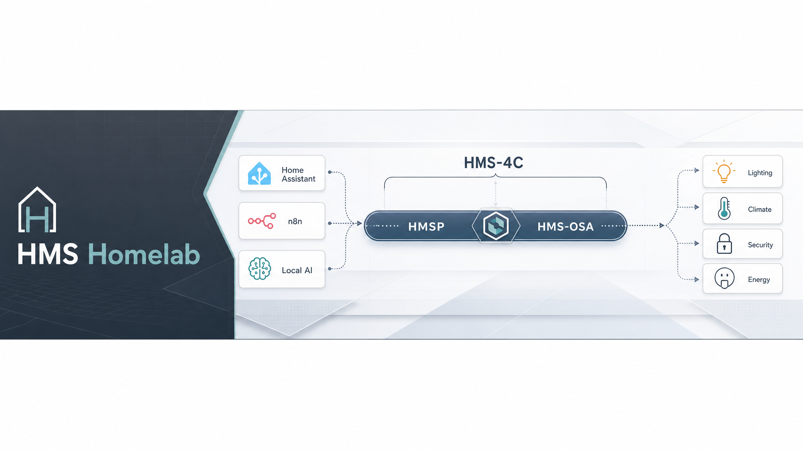
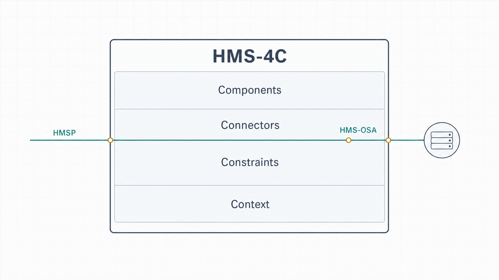

# HMS Homelab

Open, public, and experimental home-management architecture for a community-driven homelab stack.

This organization publishes practical smart-home tools and services built from the author's homelab experience. These are real projects, in use now, and they are organized to be public, inspectable, and iteratable.

## Why It Exists

Most home automation systems are built around individual products, vendor-specific integrations, or brittle glue between tools. That works for a narrow setup, but it breaks down when the environment grows across security, climate, media, comfort, monitoring, and experimentation.

HMS exists to define a more durable model:

- interactions should be understandable, not ad hoc
- device behavior should be shaped by context and constraints
- integrations should be open enough for multiple implementations
- the protocol layer should be separable from the architecture itself

The goal is not a single product. The goal is an open architecture that can survive changing devices, changing software, and changing requirements without losing coherence.

## Goal

The long-term goal of HMS is a smart home that can:

- stay self-sufficient without relying on brittle cloud glue
- diagnose itself when something changes or fails
- adapt to new devices, rooms, routines, and constraints
- predict issues before they become outages or annoyances
- prevent avoidable problems through local intelligence and clear architecture

That is why the intelligence layer sits above the operational layers: it is there to observe, infer, anticipate, and help the system improve over time rather than only react after the fact.

## Model

`HMS-4C` is the governing design frame. `HMS-OSA` is the formal open architecture definition. `HMSP` is the protocol implementation path that realizes that definition.

## 4C Pillars

The 4C pillars shape interactions across devices and services:

| Pillar | Meaning |
| --- | --- |
| Components | The replaceable parts in the system. A component can be a device, service, model, workflow, or operator-facing tool. The point is modularity: pieces can evolve without forcing the whole system to be rewritten. |
| Connectors | The interactions and links between parts. This includes the message paths, APIs, transports, and discovery mechanisms that let components cooperate without becoming tightly coupled. |
| Constraints | The limits that shape acceptable behavior. Constraints cover latency, power, bandwidth, availability, trust boundaries, and any other rule that keeps the system reliable and understandable. |
| Context | The domain-specific meaning behind each interaction. A temperature reading, motion event, or command only matters when the system knows what domain it belongs to and what should happen next. |

These pillars are the design discipline for HMS-OSA. They are the lens through which devices, services, and operators should interact.

## HMS-OSA

HMS-OSA is the public architecture definition. It describes how the 4C pillars should be implemented so any participating device or service can be discovered, understood, and integrated consistently.

The spec is intentionally public and living:

- [OSA spec document](docs/HMS-OSA.md)
- [Public HMS docs index](docs/README.md)

## HMSP

HMSP is the protocol implementation layer. It exists to make HMS-OSA practical: discovery, metadata exchange, state transport, command handling, and availability tracking.

The implementation is still experimental, but the public direction is stable:

- a device or service should be able to announce itself cleanly
- the system should know what it is, what it can do, and whether it is available
- state and control should flow through a defined contract instead of one-off glue
- future community implementations should be able to follow the same model

## Public Shape

This project is public by design, but it is still experimental.

- architecture first
- protocol second
- implementation third
- no private network details in public docs

The README explains the model at a high level. The docs directory holds the living spec and redaction notes for ongoing iteration.

## Architecture

The public model is vendor-neutral:

- any device or service can participate if it implements the architecture
- named platforms are not part of the core diagram
- external integrations are treated as abstract endpoints, not primary dependencies
- the protocol work stays open and implementation-focused

## Repositories

Key public-facing repos include:

- [`hmsp-protocol`](https://github.com/hms-homelab/hmsp-protocol) — HMSP spec, C++ library, SDKs, and draft implementation work
- [`hms-shared`](https://github.com/hms-homelab/hms-shared) — shared libraries and reusable code
- [`hms-cpap`](https://github.com/hms-homelab/hms-cpap) — CPAP data collection and Home Assistant integration
- [`hms-nut`](https://github.com/hms-homelab/hms-nut) — UPS monitoring and alerts
- [`hms-firetv`](https://github.com/hms-homelab/hms-firetv) — Fire TV automation service
- [`hms-tuya`](https://github.com/hms-homelab/hms-tuya) — Tuya WiFi bridge with HA auto-discovery

### Most Starred Public Repos

Current public standouts include:

- [`hms-cpap`](https://github.com/hms-homelab/hms-cpap) — 62 stars
- [`hms-assist-api`](https://github.com/hms-homelab/hms-assist-api) — 10 stars
- [`hms-firetv`](https://github.com/hms-homelab/hms-firetv) — 2 stars

## Public Docs

- [HMS-4C framework](docs/HMS-4C.md)
- [HMSP protocol](docs/HMSP.md)
- [HMS-OSA specification](docs/HMS-OSA.md)
- [Redaction note](docs/REDACTION.md)

## What This Org Publishes

- redacted architecture documents
- protocol and specification summaries
- experimental implementation notes
- reusable infrastructure and integration references

## Tags

- `homelab`
- `experimental`
- `protocols`
- `open-standard`
- `community`
- `architecture`
- `hms`

## Contact

Public contact: the homepage above and the published project docs. Email exposure can be added where you choose to publish it.
